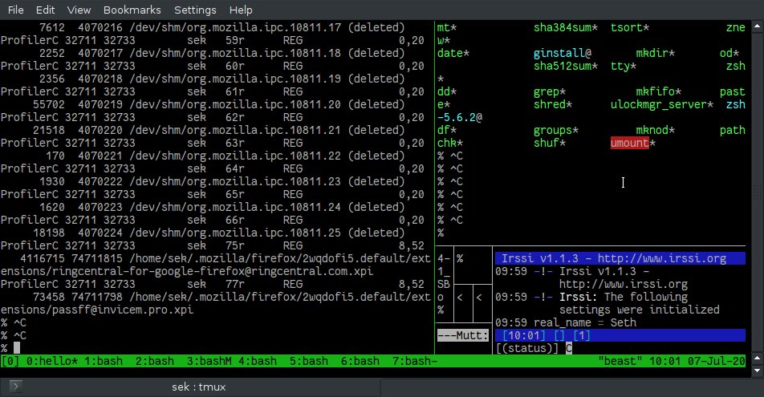

# tmux
## Installation in debian
   Due to it's popularity `tmux` is availbale on most debian or you can install as follows
    
     sudo apt-get update && sudo apt-get install tmux
    
All tmux command starts with `ctl+b` When you press it in a tmux session, it alerts tmux to "listen" for the next key or key combination that follows.
### creating new window
* To create new tmux window just place `ctrl+b` to let tmux listen and press `c` .so here `c` is command to create new windows in tmux
   
### Splitting windows into panes

Once you have created more than one window in tmux, it's often useful to see them all in one window. You can split a window horizontally (meaning the split is horizontal, placing one window in a North position and another in a South position) or vertically (with windows located in West and East positions).

   *  To create a horizontal split, press `ctrl+b` followed by `"` (that's a double-quote).
   *  To create a vertical split, press `ctrl+b` followed by `%` (percent).

 Example below  
   
   
   Sometimes things can get out of hand. You can adjust a terminal full of haphazardly split panes using these quick presets:

    Ctrl+B Alt+1: Even horizontal splits
    Ctrl+B Alt+2: Even vertical splits
    Ctrl+B Alt+3: Horizontal span for the main pane, vertical splits for lesser panes
    Ctrl+B Alt+3: Vertical span for the main pane, horizontal splits for lesser panes
    Ctrl+B Alt+5: Tiled layout
    
### Switching between panes
  To get from one pane to another, press Ctrl+B followed by O (as in other). The border around the pane changes color based on your position, and your terminal cursor changes to its active state. This method "walks" through panes in order of creation.

Alternatively, you can use your arrow keys to navigate to a pane according to your layout. For example, if you've got two open panes divided by a horizontal split, you can press Ctrl+B followed by the Up arrow to switch from the lower pane to the top pane. Likewise, Ctrl+B followed by the Down arrow switches from the upper pane to the lower one.

